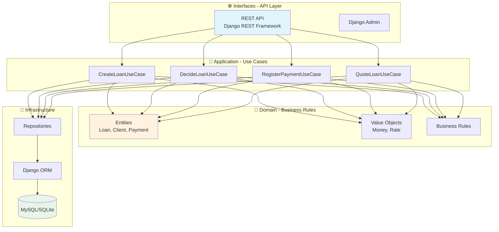
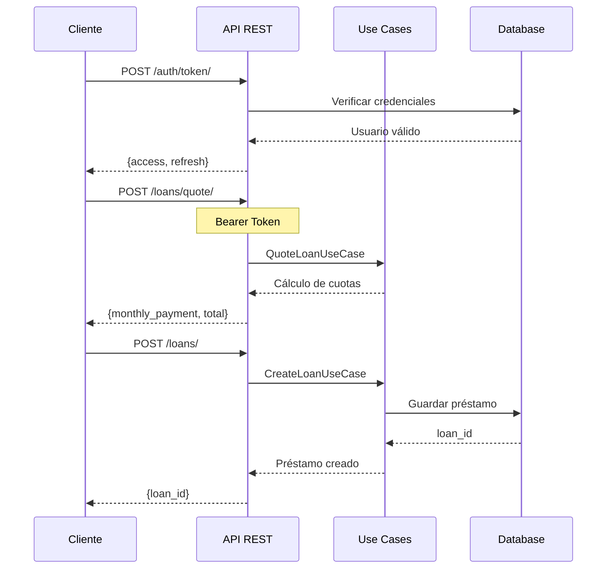
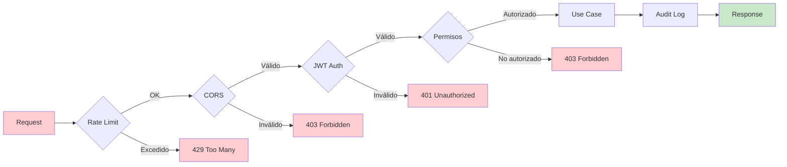
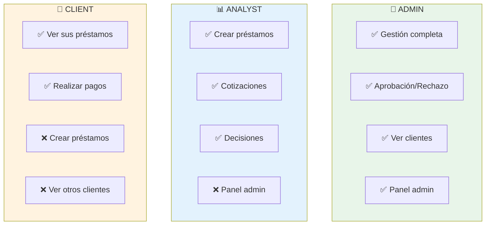

<div align="center">

# 🏦 Sistema de Préstamos Bancarios

**API REST moderna para gestión de préstamos construida con Django + Clean Architecture**

[](https://python.org)
[](https://djangoproject.com)
[](https://reactjs.org)
[](LICENSE)

[Instalación](#-instalación) •
[Arquitectura](#-arquitectura) •
[API](#-api-endpoints) •
[Documentación](#-documentación)

</div>

---

## ✨ Características

| Característica | Descripción |
|----------------|-------------|
| 🔐 **Autenticación JWT** | Tokens seguros con refresh y blacklist |
| 👥 **Roles y Permisos** | ADMIN, ANALYST, CLIENT con control granular |
| 📊 **Auditoría Completa** | Trazabilidad de todas las operaciones |
| 🛡️ **Seguridad Bancaria** | Rate limiting, CORS, CSP, HSTS |
| 🏗️ **Clean Architecture** | Dominio desacoplado del framework |
| 🐳 **Docker Ready** | MySQL containerizado para desarrollo |

---

## 🏗️ Arquitectura

El proyecto implementa **Clean Architecture / Hexagonal**, manteniendo el dominio de negocio completamente desacoplado del framework.



### 📂 Estructura del Proyecto

```
Banco/
├── 📁 loan_system/              # Código principal del backend
│   ├── 📁 domain/               # 💎 Entidades y reglas de negocio
│   ├── 📁 application/          # 📱 Casos de uso y puertos
│   ├── 📁 infrastructure/       # 🔧 Django, ORM, repositorios
│   ├── 📁 interfaces/           # 🌐 API REST (DRF)
│   ├── 📁 events/               # ⚡ Tareas Celery
│   └── 📁 tests/                # ✅ Tests con pytest
│
├── 📁 frontend/                 # React + Vite
│   └── 📁 src/
│       ├── 📁 components/       # Componentes reutilizables
│       ├── 📁 pages/            # Páginas principales
│       └── 📁 services/         # Cliente API
│
├── 📁 docs/                     # 📚 Documentación técnica
└── 📁 scripts/                  # 🔧 Scripts de utilidad
```

---

## 🚀 Instalación

### Requisitos Previos

- **Python 3.11+**
- **Node.js 18+** (para frontend)
- **Docker Desktop** (opcional, para MySQL)

### 1️⃣ Clonar y Configurar Backend

```powershell
# Clonar repositorio
git clone https://github.com/tu-usuario/banco.git
cd banco

# Crear entorno virtual
python -m venv .venv
.\.venv\Scripts\Activate.ps1

# Instalar dependencias
pip install -r requirements.txt

# Configurar variables de entorno
copy .env.example .env
# Editar .env con tus credenciales
```

### 2️⃣ Inicializar Base de Datos

```powershell
# Aplicar migraciones
python loan_system/manage.py migrate

# Crear datos de prueba
python loan_system/manage.py seed_initial_data

# Iniciar servidor
python loan_system/manage.py runserver
```

### 3️⃣ Configurar Frontend

```powershell
cd frontend
npm install
npm run dev
```

### 🐳 Alternativa: Docker con MySQL

```powershell
# Ejecutar todo el flujo E2E automatizado
.\scripts\e2e_mysql.ps1
```

---

## 🔌 API Endpoints

### Diagrama de Flujo de la API



### Endpoints Disponibles

| Método | Endpoint | Descripción | Roles |
|--------|----------|-------------|-------|
| `POST` | `/api/auth/token/` | Obtener JWT tokens | Público |
| `POST` | `/api/auth/token/refresh/` | Refrescar access token | Público |
| `GET` | `/api/loans/` | Listar préstamos | ADMIN, ANALYST |
| `POST` | `/api/loans/` | Crear préstamo | ADMIN, ANALYST |
| `POST` | `/api/loans/quote/` | Cotizar préstamo | ADMIN, ANALYST |
| `POST` | `/api/loans/{id}/decision/` | Aprobar/Rechazar | ADMIN, ANALYST |
| `GET` | `/api/clients/` | Listar clientes | ADMIN, ANALYST |
| `POST` | `/api/payments/` | Registrar pago | Todos |

### Ejemplos Rápidos

<details>
<summary>🔐 Obtener Token JWT</summary>

```bash
curl -X POST http://127.0.0.1:8000/api/auth/token/ \
  -H "Content-Type: application/json" \
  -d '{"username":"admin","password":"admin1234"}'
```

**Respuesta:**
```json
{
  "access": "eyJ0eXAiOiJKV1QiLCJhbGciOiJIUzI1NiJ9...",
  "refresh": "eyJ0eXAiOiJKV1QiLCJhbGciOiJIUzI1NiJ9..."
}
```
</details>

<details>
<summary>💰 Cotizar Préstamo</summary>

```bash
curl -X POST http://127.0.0.1:8000/api/loans/quote/ \
  -H "Authorization: Bearer <ACCESS_TOKEN>" \
  -H "Content-Type: application/json" \
  -d '{
    "principal_amount": "10000.00",
    "currency": "USD",
    "monthly_rate": "0.025",
    "term_months": 12
  }'
```

**Respuesta:**
```json
{
  "monthly_payment": "951.23",
  "total_payment": "11414.76",
  "total_interest": "1414.76"
}
```
</details>

<details>
<summary>📝 Crear Préstamo</summary>

```bash
curl -X POST http://127.0.0.1:8000/api/loans/ \
  -H "Authorization: Bearer <ACCESS_TOKEN>" \
  -H "Content-Type: application/json" \
  -d '{
    "client_id": "<uuid>",
    "principal_amount": "5000.00",
    "currency": "USD",
    "monthly_rate": "0.02",
    "term_months": 6
  }'
```
</details>

---

## 🔐 Seguridad

El sistema implementa múltiples capas de seguridad siguiendo estándares bancarios:



### Controles Implementados

| Control | Descripción |
|---------|-------------|
| 🔑 **JWT + Blacklist** | Tokens con rotación y revocación |
| 🛡️ **Rate Limiting** | Protección contra abuso por IP |
| 🌐 **CORS** | Orígenes configurables por entorno |
| 📝 **Security Headers** | CSP, HSTS, X-Frame-Options, etc. |
| 🔒 **Password Hashing** | PBKDF2 con salt |
| 📊 **Audit Logging** | Registro de operaciones sensibles |
| 🔐 **HTTPS** | Obligatorio en producción |

---

## 👥 Roles y Permisos



---

## 🧪 Tests

```powershell
# Ejecutar todos los tests
pytest

# Con cobertura
pytest --cov=loan_system

# Solo tests de dominio
pytest loan_system/tests/domain/

# Solo tests de API
pytest loan_system/tests/application/
```

---

## 📚 Documentación

| Documento | Descripción |
|-----------|-------------|
| [📖 API Reference](docs/API.md) | Endpoints, payloads y ejemplos completos |
| [🏗️ Arquitectura](docs/ARQUITECTURA.md) | Clean Architecture y decisiones de diseño |
| [🔐 Seguridad](docs/SEGURIDAD.md) | Configuración, credenciales y auditoría |
| [🛠️ Desarrollo](docs/DESARROLLO.md) | Guía para desarrolladores y tests |
| [⚙️ Operaciones](docs/OPERACION.md) | Runbook, Docker y despliegue |

---

## 🛠️ Scripts Útiles

| Script | Descripción |
|--------|-------------|
| `.\scripts\run_dev.ps1` | Inicia backend + frontend |
| `.\scripts\start_backend.ps1` | Solo backend en segundo plano |
| `.\scripts\start_frontend.ps1` | Solo frontend en segundo plano |
| `.\scripts\e2e_mysql.ps1` | Test E2E con Docker MySQL |
| `.\scripts\cleanup.ps1` | Limpieza de archivos temporales |
| `python scripts\validate_security.py` | Validar configuración de seguridad |

---

## 🔧 Configuración de Entorno

El proyecto usa variables de entorno (`.env`):

```ini
# Django
DJANGO_SECRET_KEY=tu-clave-secreta-generada
DJANGO_DEBUG=1
DJANGO_ALLOWED_HOSTS=localhost,127.0.0.1

# Base de datos (prioridad: MySQL > DATABASE_URL > SQLite)
MYSQL_NAME=loan_system_db
MYSQL_USER=loan_user
MYSQL_PASSWORD=tu-password-seguro
MYSQL_HOST=127.0.0.1
MYSQL_PORT=3307

# JWT
JWT_ACCESS_MINUTES=15
JWT_REFRESH_DAYS=7

# CORS
DJANGO_CORS_ALLOWED_ORIGINS=http://localhost:5173
```

### Generar Credenciales Seguras

```powershell
python loan_system/manage.py generate_secrets --all
```

---

## 📄 Licencia

Este proyecto está bajo la Licencia MIT. Ver [LICENSE](LICENSE) para más detalles.

---

<div align="center">

**[⬆ Volver arriba](#-sistema-de-préstamos-bancarios)**

Desarrollado con ❤️ usando Django + React

</div>
