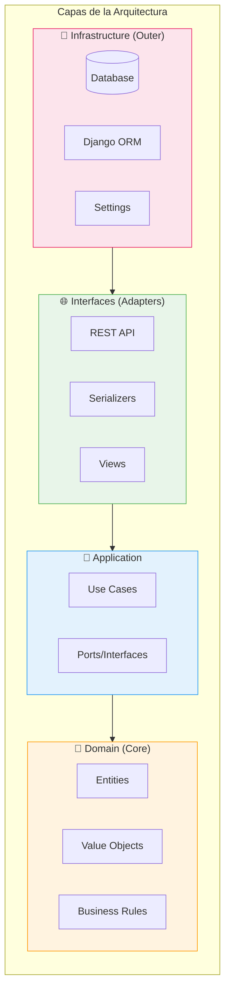
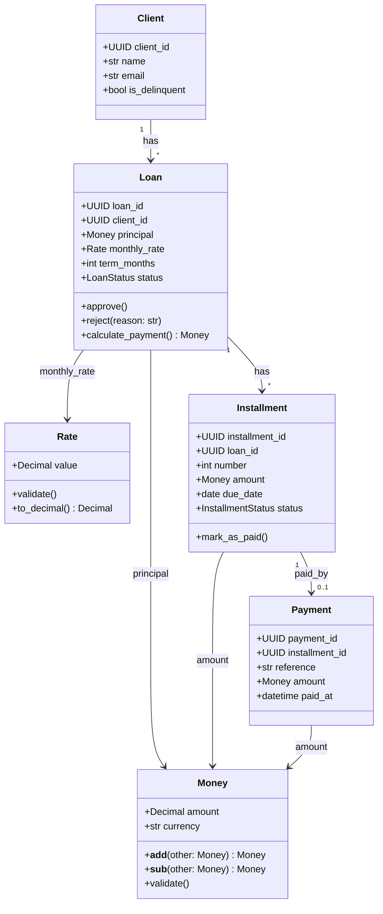
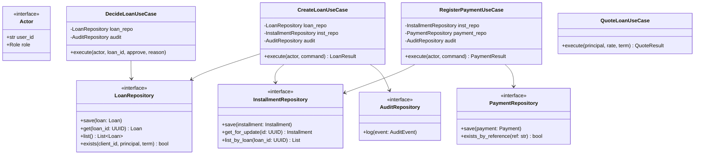
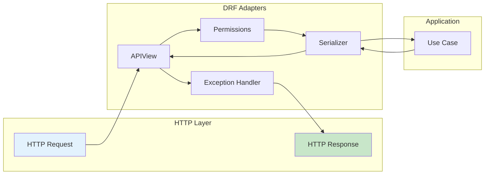
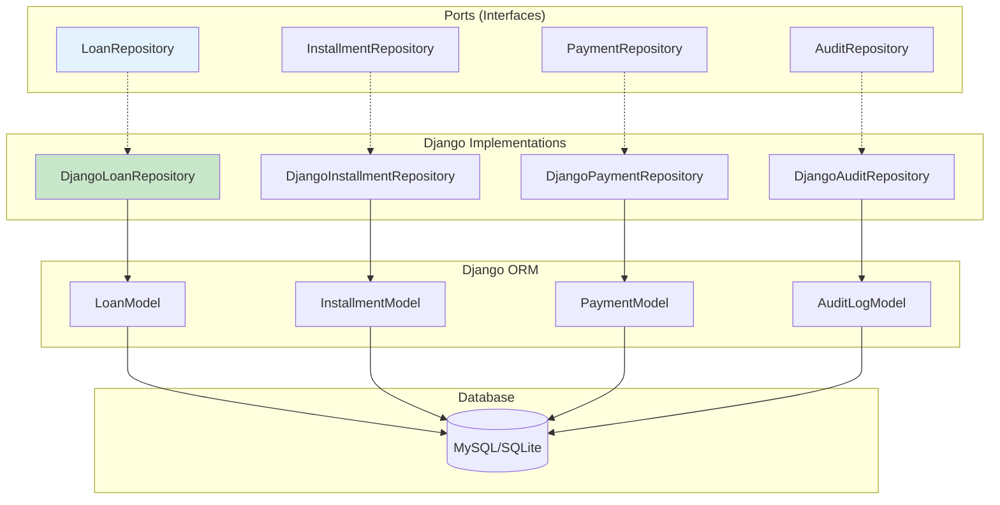
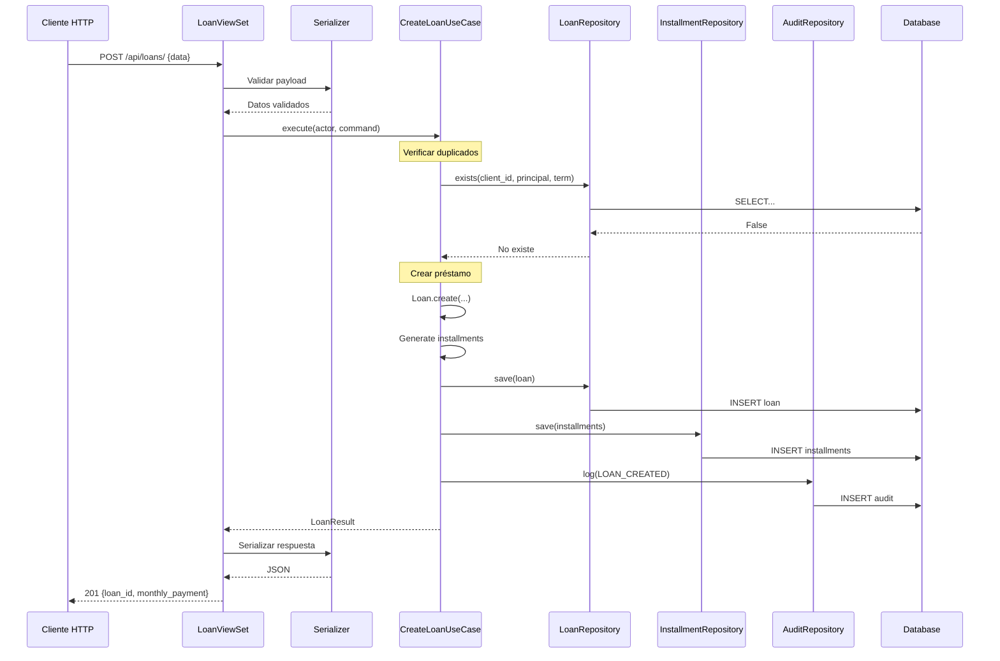
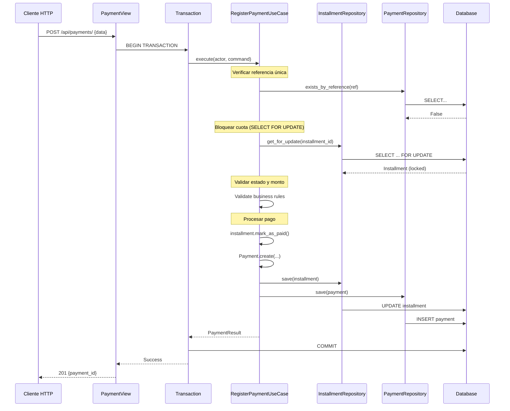
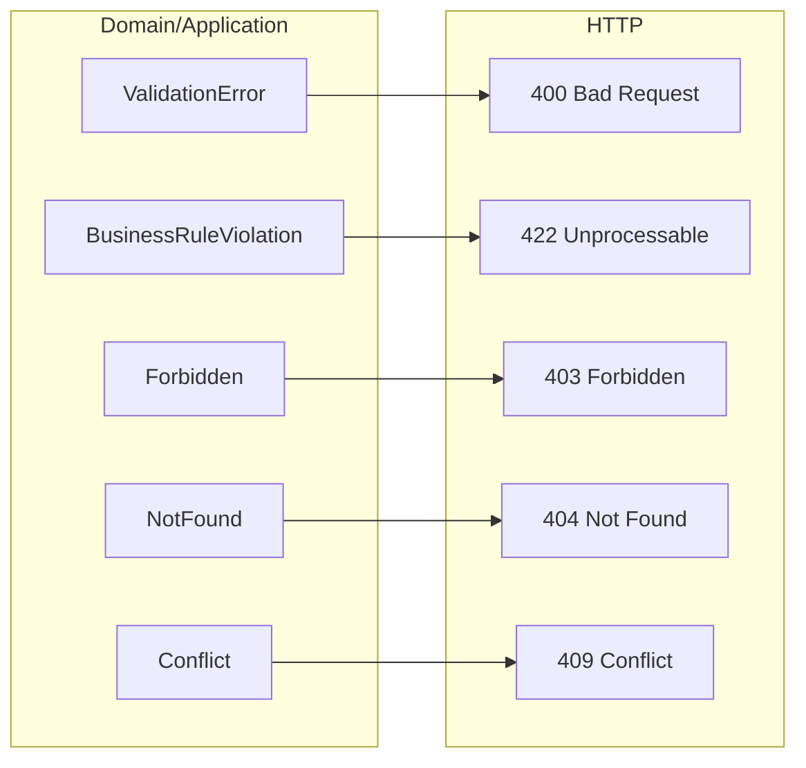

# 🏗️ Arquitectura

Este documento describe la arquitectura del Sistema de Préstamos Bancarios, implementado siguiendo principios de **Clean Architecture / Hexagonal**.

---

## 📋 Índice

- [Visión General](#-visión-general)
- [Capas de la Arquitectura](#-capas-de-la-arquitectura)
- [Diagramas UML](#-diagramas-uml)
- [Flujos de Datos](#-flujos-de-datos)
- [Decisiones de Diseño](#-decisiones-de-diseño)

---

## 🎯 Visión General

La arquitectura separa el código en capas concéntricas donde las dependencias apuntan hacia el centro (dominio). Esto permite:

- ✅ **Testabilidad**: El dominio se prueba sin framework
- ✅ **Flexibilidad**: Cambiar DB/Framework sin tocar negocio
- ✅ **Mantenibilidad**: Código organizado por responsabilidad
- ✅ **Escalabilidad**: Añadir features sin afectar existentes



---

## 📁 Capas de la Arquitectura

### 💎 Domain (`loan_system/domain/`)

El **núcleo** del sistema. Contiene reglas de negocio puras sin dependencias externas.



**Archivos principales:**
- `entities.py` - Entidades de dominio (Loan, Installment, Payment, Client)
- `value_objects.py` - Value Objects (Money, Rate)
- `exceptions.py` - Excepciones de dominio (ValidationError, BusinessRuleViolation)

### 📱 Application (`loan_system/application/`)

Orquesta la lógica de negocio mediante **Use Cases** y define contratos con el exterior mediante **Ports**.



**Archivos principales:**
- `use_cases.py` - Casos de uso del sistema
- `ports.py` - Interfaces/Protocolos para repositorios
- `exceptions.py` - Excepciones de aplicación (NotFound, Conflict, Forbidden)

### 🌐 Interfaces (`loan_system/interfaces/`)

Adaptadores de entrada. Traducen HTTP → comandos de aplicación y errores → respuestas HTTP.



**Archivos principales:**
- `api/views.py` - Vistas DRF
- `api/serializers.py` - Serializadores de entrada/salida
- `api/permissions.py` - Permisos por rol
- `api/exception_handler.py` - Mapeo de excepciones a HTTP

### 🔧 Infrastructure (`loan_system/infrastructure/`)

Adaptadores de salida. Implementaciones concretas de los ports.



**Estructura:**
```
infrastructure/
├── config/              # Configuración Django
│   ├── settings.py
│   ├── urls.py
│   └── celery.py
├── django_apps/         # Apps Django
│   ├── accounts/        # Usuarios y perfiles
│   ├── loans/           # Modelos de préstamos
│   └── audit/           # Auditoría
├── repositories/        # Implementaciones de ports
│   ├── django_repositories.py
│   └── clock.py
└── security/            # Middlewares de seguridad
    ├── request_id.py
    └── security_middleware.py
```

---

## 🔄 Flujos de Datos

### Crear Préstamo



### Registrar Pago



---

## 🎨 Decisiones de Diseño

### 1. Decimal para Cantidades Financieras

```python
# ❌ Mal - Errores de punto flotante
amount = 0.1 + 0.2  # = 0.30000000000000004

# ✅ Bien - Precisión exacta
from decimal import Decimal
amount = Decimal("0.1") + Decimal("0.2")  # = Decimal("0.3")
```

Usamos `Decimal` en los Value Objects `Money` y `Rate` para evitar errores de precisión en cálculos financieros.

### 2. Transacciones y Bloqueo Optimista

Para operaciones críticas como pagos, usamos:

```python
with transaction.atomic():
    # SELECT ... FOR UPDATE bloquea la fila
    installment = repo.get_for_update(installment_id)
    
    if installment.status == 'paid':
        raise Conflict("Already paid")
    
    # Procesar pago
    installment.mark_as_paid()
    repo.save(installment)
```

Esto previene condiciones de carrera donde dos pagos podrían procesarse simultáneamente para la misma cuota.

### 3. Mapeo de Excepciones



### 4. Shims de Import

Los directorios en la raíz (`domain/`, `application/`, etc.) son "shims" que redirigen a `loan_system/`:

```python
# domain/__init__.py
from pathlib import Path
import sys

# Extiende __path__ para incluir loan_system/domain
__path__.append(str(Path(__file__).parent.parent / "loan_system" / "domain"))
```

Esto permite:
- Ejecutar `pytest` desde la raíz
- Imports consistentes: `from domain.entities import Loan`
- Compatibilidad con herramientas de desarrollo

### 5. MySQL en Modo Estricto

```python
DATABASES = {
    'default': {
        'ENGINE': 'django.db.backends.mysql',
        'OPTIONS': {
            'init_command': "SET sql_mode='STRICT_TRANS_TABLES'",
        },
    }
}
```

Esto previene coerciones silenciosas de datos que podrían causar pérdida de información financiera.

---

## 📚 Referencias

- [Clean Architecture - Robert C. Martin](https://blog.cleancoder.com/uncle-bob/2012/08/13/the-clean-architecture.html)
- [Hexagonal Architecture - Alistair Cockburn](https://alistair.cockburn.us/hexagonal-architecture/)
- [Django REST Framework](https://www.django-rest-framework.org/)
- [Domain-Driven Design - Eric Evans](https://domainlanguage.com/ddd/)
