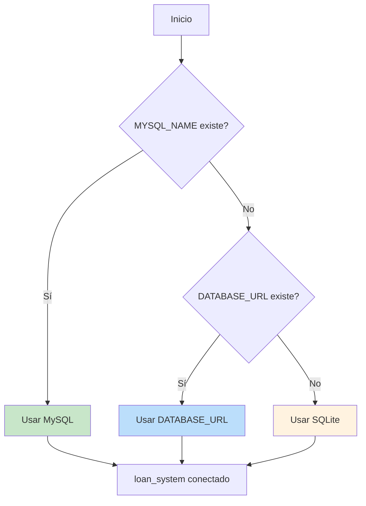

# ⚙️ Operaciones

Runbook para despliegue y operación del Sistema de Préstamos Bancarios.

---

## 📋 Índice

- [Requisitos](#-requisitos)
- [Configuración de Base de Datos](#-configuración-de-base-de-datos)
- [Despliegue con Docker](#-despliegue-con-docker)
- [Comandos de Gestión](#-comandos-de-gestión)
- [Monitoreo](#-monitoreo)
- [Troubleshooting](#-troubleshooting)

---

## 📦 Requisitos

| Componente | Versión | Notas |
|------------|---------|-------|
| Python | 3.11+ | Recomendado |
| Node.js | 18+ | Para frontend |
| Docker Desktop | Latest | Para MySQL containerizado |
| MySQL | 8.0 | O SQLite para desarrollo |

---

## 🗄️ Configuración de Base de Datos

### Prioridad de Conexión



### SQLite (Desarrollo Rápido)

```powershell
# No requiere configuración adicional
python loan_system/manage.py migrate
python loan_system/manage.py runserver
```

Base de datos: `loan_system/db.sqlite3`

### MySQL (Recomendado para Producción)

Variables de entorno requeridas:

```ini
MYSQL_NAME=loan_system_db
MYSQL_USER=loan_user
MYSQL_PASSWORD=tu-password-seguro
MYSQL_HOST=127.0.0.1
MYSQL_PORT=3307
MYSQL_ROOT_PASSWORD=root-password-seguro
```

Características habilitadas:
- **Modo estricto**: `STRICT_TRANS_TABLES`
- **Charset**: `utf8mb4`
- **Driver**: PyMySQL (incluido en requirements.txt)

---

## 🐳 Despliegue con Docker

### Arquitectura

```mermaid
graph LR
    subgraph "Host"
        FE[Frontend<br/>:5173]
        BE[Backend<br/>:8000]
    end
    
    subgraph "Docker"
        MYSQL[(MySQL<br/>:3307→3306)]
        REDIS[(Redis<br/>:6379)]
    end
    
    FE --> BE
    BE --> MYSQL
    BE --> REDIS
    
    style FE fill:#61dafb
    style BE fill:#0c4b33
    style MYSQL fill:#00758f
    style REDIS fill:#dc382d
```



### Script E2E Automatizado

El script `e2e_mysql.ps1` realiza todo el flujo:

```powershell
Set-ExecutionPolicy -Scope Process Bypass -Force
.\scripts\e2e_mysql.ps1
```

**Qué hace:**
1. ✅ Verifica Docker Desktop
2. ✅ Crea/arranca contenedor MySQL (`banco-mysql`)
3. ✅ Exporta variables de entorno
4. ✅ Ejecuta migraciones
5. ✅ Carga datos de prueba (seed)
6. ✅ Inicia servidor Django
7. ✅ Ejecuta tests de endpoints
8. ✅ Valida respuestas (incluyendo duplicados 409)

### Docker Manual

```powershell
# Crear contenedor MySQL
docker run -d `
  --name banco-mysql `
  -e MYSQL_ROOT_PASSWORD=$env:MYSQL_ROOT_PASSWORD `
  -e MYSQL_DATABASE=loan_system_db `
  -e MYSQL_USER=loan_user `
  -e MYSQL_PASSWORD=$env:MYSQL_PASSWORD `
  -p 3307:3306 `
  mysql:8.0

# Verificar estado
docker ps
docker logs banco-mysql
```

---

## 🔧 Comandos de Gestión

### Migraciones

```powershell
# Crear migraciones
python loan_system/manage.py makemigrations

# Aplicar migraciones
python loan_system/manage.py migrate

# Ver estado
python loan_system/manage.py showmigrations
```

### Datos de Prueba

```powershell
# Cargar seed (idempotente)
python loan_system/manage.py seed_initial_data
```

El seed crea:
- Usuario `admin` (password: `admin1234`, rol: ADMIN)
- Usuario `client1` (password: `client1234`, rol: CLIENT)
- Un préstamo aprobado con cuota pendiente

### Credenciales

```powershell
# Generar todas las credenciales
python loan_system/manage.py generate_secrets --all

# Solo SECRET_KEY
python loan_system/manage.py generate_secrets --secret-key

# Validar configuración de seguridad
python scripts/validate_security.py
```

### Usuario Administrador

```powershell
python loan_system/manage.py createsuperuser
```

---

## 📊 Monitoreo

### Logs

El sistema usa logging estructurado JSON con request IDs:

```json
{
  "timestamp": "2026-01-05T12:34:56.789Z",
  "level": "INFO",
  "request_id": "abc-123-def-456",
  "message": "Payment registered successfully",
  "user": "client1",
  "loan_id": "uuid-...",
  "amount": "500.00"
}
```

### Auditoría

Acceder via Django Admin: `http://127.0.0.1:8000/admin/audit/auditlog/`

O por shell:

```python
from infrastructure.django_apps.audit.models import AuditLog

# Últimos 10 eventos
for log in AuditLog.objects.order_by('-created_at')[:10]:
    print(f"{log.created_at} - {log.event_type} - {log.user}")
```

### Health Check

```powershell
# Verificar que la API responde
curl http://127.0.0.1:8000/api/auth/token/ -X POST `
  -H "Content-Type: application/json" `
  -d '{"username":"admin","password":"admin1234"}'
```

---

## 🔥 Celery (Tareas Asíncronas)

### Configuración

```ini
# .env
CELERY_BROKER_URL=redis://localhost:6379/0
CELERY_RESULT_BACKEND=redis://localhost:6379/1
```

### Iniciar Worker

```powershell
# Iniciar Redis (Docker)
docker run -d --name redis -p 6379:6379 redis:alpine

# Iniciar worker Celery
celery -A infrastructure.config worker -l info
```

### Tareas Disponibles

Las tareas están definidas en `loan_system/events/tasks.py` (actualmente placeholders).

---

## 🔧 Troubleshooting

### MySQL no conecta

```powershell
# Verificar contenedor
docker ps -a | Select-String banco-mysql

# Ver logs
docker logs banco-mysql

# Reiniciar
docker restart banco-mysql

# Verificar puerto
Test-NetConnection -ComputerName localhost -Port 3307
```

### Error de migraciones

```powershell
# Resetear base de datos (CUIDADO: borra datos)
python scripts/reset_db.py

# Reaplicar migraciones
python loan_system/manage.py migrate --run-syncdb
```

### Token JWT inválido

```powershell
# Limpiar tokens expirados
python loan_system/manage.py flush_expired_tokens

# Obtener nuevo token
curl -X POST http://127.0.0.1:8000/api/auth/token/ `
  -H "Content-Type: application/json" `
  -d '{"username":"admin","password":"admin1234"}'
```

### Rate limit excedido

Esperar 1 minuto o reiniciar el servidor de desarrollo.

### Frontend no conecta con Backend

```powershell
# Verificar que backend está corriendo
curl http://127.0.0.1:8000/api/

# Verificar proxy en vite.config.js
# El frontend debe proxyear /api a :8000
```

---

## 📋 Checklist de Despliegue

### Desarrollo

- [ ] Clonar repositorio
- [ ] Crear `.env` desde `.env.example`
- [ ] Instalar dependencias (`pip install -r requirements.txt`)
- [ ] Ejecutar migraciones
- [ ] Cargar datos de prueba
- [ ] Iniciar servidor

### Staging

- [ ] Generar credenciales únicas
- [ ] Configurar MySQL en servidor
- [ ] DEBUG=0
- [ ] Configurar CORS para dominio staging
- [ ] Habilitar HTTPS
- [ ] Ejecutar validación de seguridad

### Producción

- [ ] Credenciales únicas y fuertes
- [ ] DEBUG=0 (OBLIGATORIO)
- [ ] MySQL con usuario no-root
- [ ] HTTPS obligatorio
- [ ] HSTS habilitado
- [ ] Rate limiting configurado
- [ ] Logs de auditoría activos
- [ ] Backups configurados
- [ ] Monitoreo activo
