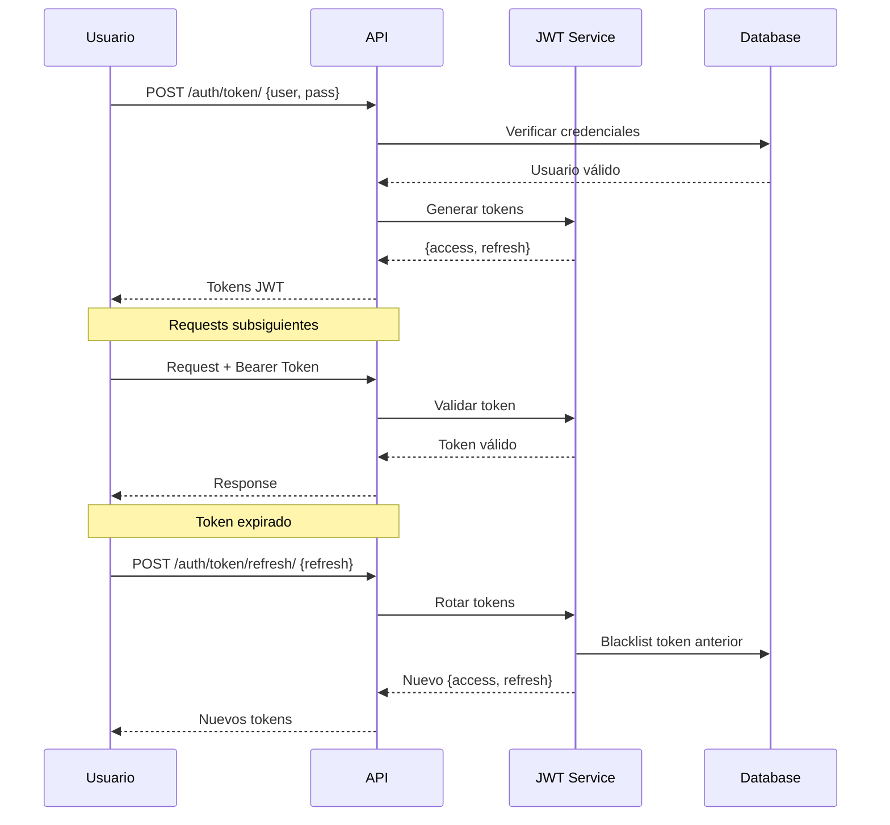
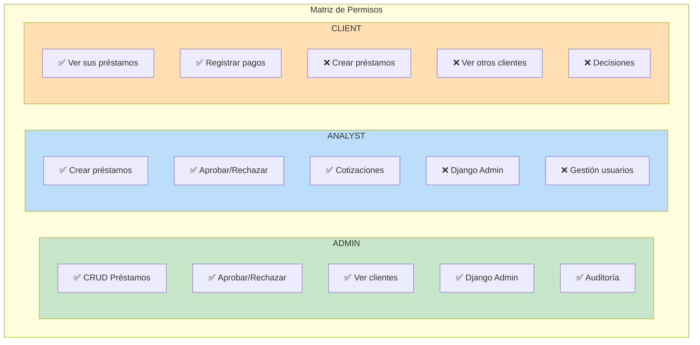
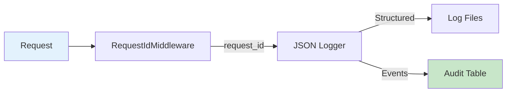

# 🔐 Seguridad

Este documento consolida toda la información de seguridad del sistema de préstamos bancarios.

---

## 📋 Índice

- [Estado de Seguridad](#-estado-de-seguridad)
- [Autenticación JWT](#-autenticación-jwt)
- [Roles y Permisos](#-roles-y-permisos)
- [Protecciones Implementadas](#-protecciones-implementadas)
- [Configuración de Credenciales](#-configuración-de-credenciales)
- [Headers de Seguridad](#-headers-de-seguridad)
- [Auditoría](#-auditoría)
- [Checklist por Entorno](#-checklist-por-entorno)

---

## ✅ Estado de Seguridad

**Última Auditoría:** Enero 2026  
**Estado:** ✅ Sistema seguro - Sin vulnerabilidades críticas

```
🔐 RESUMEN DE AUDITORÍA
============================================================
✅ Vulnerabilidades Críticas: 0
✅ Vulnerabilidades Medias: 0
✅ Controles Implementados: 12+
============================================================
```

---

## 🔑 Autenticación JWT

El sistema usa `djangorestframework-simplejwt` para autenticación:



### Configuración

| Variable | Descripción | Default |
|----------|-------------|---------|
| `JWT_ACCESS_MINUTES` | Duración del access token | 15 min |
| `JWT_REFRESH_DAYS` | Duración del refresh token | 7 días |
| `ROTATE_REFRESH_TOKENS` | Rotar en cada refresh | True |
| `BLACKLIST_AFTER_ROTATION` | Invalidar tokens rotados | True |

### Blacklist de Tokens

Cuando un usuario cierra sesión o se rota un token, el anterior se añade a la blacklist para prevenir reutilización:

```python
# Los tokens rotados se invalidan automáticamente
SIMPLE_JWT = {
    'ROTATE_REFRESH_TOKENS': True,
    'BLACKLIST_AFTER_ROTATION': True,
}
```

---

## 👥 Roles y Permisos



### Implementación

**API Level (DRF Permissions):**
```python
class AdminOrAnalyst(BasePermission):
    """Permite acceso solo a ADMIN o ANALYST"""
    
class AnyAuthenticated(BasePermission):
    """Permite acceso a cualquier usuario autenticado"""
```

**Use Case Level (Defense in Depth):**
```python
class RegisterPaymentUseCase:
    def execute(self, actor: Actor, ...):
        # Validación adicional por rol
        if actor.role not in [Role.ADMIN, Role.ANALYST, Role.CLIENT]:
            raise Forbidden("No autorizado")
```

---

## 🛡️ Protecciones Implementadas

### Rate Limiting

Protección contra abuso implementada con `django-ratelimit`:

| Endpoint | Límite | Motivo |
|----------|--------|--------|
| `/api/auth/token/` | 10/min | Prevenir brute force |
| `/api/loans/quote/` | 60/min | Limitar carga |
| `/api/loans/` | 20/min | Operaciones costosas |
| `/api/loans/{id}/decision/` | 20/min | Operaciones críticas |
| `/api/payments/` | 30/min | Operaciones financieras |

### CORS

```python
# Desarrollo
CORS_ALLOWED_ORIGINS = ["http://localhost:5173"]

# Producción
CORS_ALLOWED_ORIGINS = ["https://tu-dominio.com"]
CORS_ALLOW_CREDENTIALS = True
```

### Protección de Cookies

```python
SESSION_COOKIE_HTTPONLY = True
SESSION_COOKIE_SAMESITE = "Strict"
CSRF_COOKIE_HTTPONLY = True
CSRF_COOKIE_SAMESITE = "Strict"

# En producción (DEBUG=0)
SESSION_COOKIE_SECURE = True
CSRF_COOKIE_SECURE = True
```

---

## 🔧 Configuración de Credenciales

### ⚠️ Regla de Oro

> **NUNCA** commitear el archivo `.env` al repositorio Git.

### Generar Credenciales Seguras

```powershell
# Generar todas las credenciales
python loan_system/manage.py generate_secrets --all

# Generar solo SECRET_KEY
python loan_system/manage.py generate_secrets --secret-key

# Generar solo passwords MySQL
python loan_system/manage.py generate_secrets --mysql
```

### Configurar Variables de Entorno

**Opción 1: Archivo .env**
```ini
DJANGO_SECRET_KEY=tu-clave-generada-50-chars-min
MYSQL_PASSWORD=password-seguro-32-chars
MYSQL_ROOT_PASSWORD=root-password-48-chars
```

**Opción 2: Variables de sesión PowerShell**
```powershell
$env:DJANGO_SECRET_KEY = "tu-clave-generada"
$env:MYSQL_PASSWORD = "password-generado"
```

**Opción 3: Variables permanentes (recomendado)**
```powershell
[Environment]::SetEnvironmentVariable("MYSQL_PASSWORD", "tu-pass", "User")
```

### Rotación de Credenciales

**Cuándo rotar:**
- Sospecha de compromiso
- Empleado con acceso deja la empresa
- Cada 90 días (buena práctica)
- Antes de ir a producción

**Proceso:**
1. Generar nuevas credenciales
2. Actualizar `.env`
3. Reiniciar servicios
4. Invalidar tokens JWT activos

```powershell
python loan_system/manage.py flush_expired_tokens
```

---

## 📝 Headers de Seguridad

En producción (`DEBUG=0`), se activan automáticamente:

```python
# Content Security Policy
Content-Security-Policy: default-src 'self'; script-src 'self'; style-src 'self' 'unsafe-inline'

# Frame Protection
X-Frame-Options: DENY

# MIME Sniffing
X-Content-Type-Options: nosniff

# XSS Filter
X-XSS-Protection: 1; mode=block

# HTTPS Strict Transport
Strict-Transport-Security: max-age=31536000; includeSubDomains; preload

# Permissions Policy
Permissions-Policy: geolocation=(), microphone=(), camera=()

# Referrer Policy
Referrer-Policy: strict-origin-when-cross-origin
```

---

## 📊 Auditoría

### Sistema de Logging



Cada request recibe un `request_id` único que se propaga a través del sistema:

```json
{
  "timestamp": "2026-01-05T12:34:56.789Z",
  "level": "INFO",
  "request_id": "abc-123-def",
  "message": "Payment registered",
  "user": "client1",
  "loan_id": "uuid-...",
  "amount": "500.00"
}
```

### Eventos Auditados

| Evento | Descripción |
|--------|-------------|
| `LOAN_CREATED` | Préstamo creado |
| `LOAN_APPROVED` | Préstamo aprobado |
| `LOAN_REJECTED` | Préstamo rechazado |
| `PAYMENT_REGISTERED` | Pago registrado |
| `LOGIN_SUCCESS` | Login exitoso |
| `LOGIN_FAILED` | Login fallido |

### Consultar Auditoría

```python
from infrastructure.django_apps.audit.models import AuditLog

# Últimos eventos
AuditLog.objects.order_by('-created_at')[:100]

# Eventos de un usuario
AuditLog.objects.filter(user='admin')

# Eventos por tipo
AuditLog.objects.filter(event_type='PAYMENT_REGISTERED')
```

---

## ✅ Checklist por Entorno

### Desarrollo

- [x] SECRET_KEY único (no usar el de ejemplo)
- [x] Passwords generados con `generate_secrets`
- [x] DEBUG=1 permitido
- [x] CORS permite localhost
- [ ] HTTPS no requerido

### Staging/QA

- [x] SECRET_KEY diferente a desarrollo
- [x] DEBUG=0
- [x] CORS solo dominio staging
- [x] SSL/HTTPS habilitado
- [x] HSTS habilitado

### Producción

- [x] SECRET_KEY único y fuerte (50+ chars)
- [x] DEBUG=0 **(OBLIGATORIO)**
- [x] CORS solo dominios autorizados
- [x] SSL/HTTPS **(OBLIGATORIO)**
- [x] HSTS con preload (1 año)
- [x] Passwords rotativos (cada 90 días)
- [x] Logs de auditoría habilitados
- [x] Rate limiting estricto
- [x] CSP habilitado
- [x] Base de datos con usuario NO root

---

## 🆘 Emergencia: Credenciales Comprometidas

1. **INMEDIATO**: Rotar TODAS las credenciales
   ```powershell
   python loan_system/manage.py generate_secrets --all
   ```

2. **INVALIDAR**: Todos los tokens JWT
   ```powershell
   python loan_system/manage.py flush_expired_tokens
   ```

3. **REVISAR**: Logs de auditoría
   ```python
   AuditLog.objects.filter(created_at__gte=fecha_sospecha)
   ```

4. **NOTIFICAR**: Al equipo y usuarios afectados

5. **DOCUMENTAR**: Incidente para prevención futura

---

## 🔧 Validación de Seguridad

Ejecuta el validador automático:

```powershell
python scripts/validate_security.py
```

Este script verifica:
- ✅ `.env` no está en Git
- ✅ SECRET_KEY es seguro
- ✅ DEBUG está deshabilitado (producción)
- ✅ CORS está configurado correctamente
- ✅ Headers de seguridad activos
- ✅ JWT blacklist habilitado
